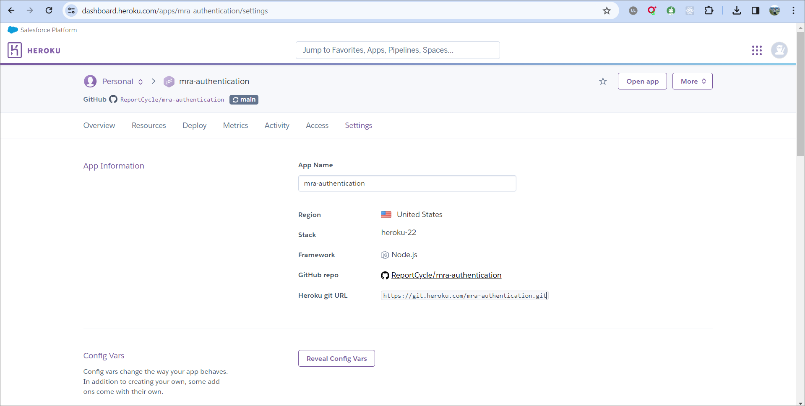
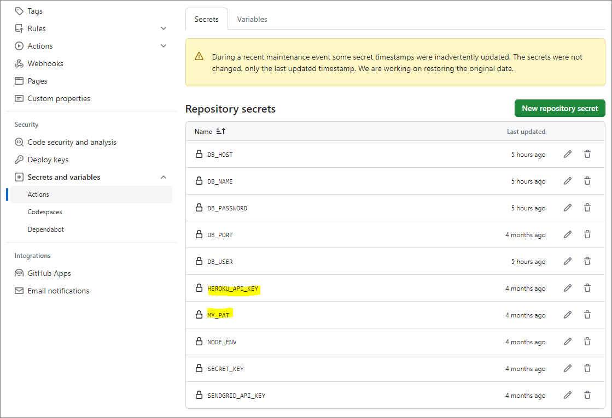
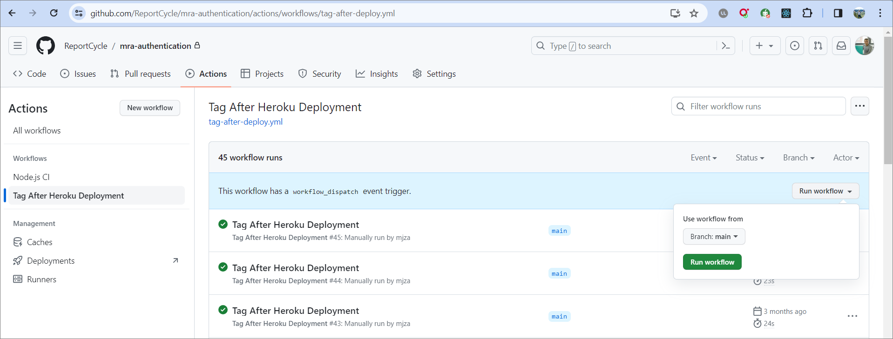

# mra-authentication

## Install Heroku CLI
Follow the instructions in this [link](https://devcenter.heroku.com/articles/heroku-cli#verify-your-installation) and install Heroku CLI. 

## local
Copy `.env.example` file and rename it to `.env.development`.
Update its content accordingly with respect to your system. 

## production

For the production: 
1. You must change the `XXX` in the following list accordingly from `Settings` tab of the `mra-database` application. 

2. You must change `YYY` must be replaced via [https://app.sendgrid.com/settings/api_keys](https://app.sendgrid.com/settings/api_keys).

```bash
heroku config:set BASE_URL=https://auth.myreport.app --app mra-authentication
heroku config:set COMPANY_ADDRESS=4515 Varsity Dr. NW, <br/>Calgary T3A0Z8, Canada --app mra-authentication
heroku config:set COMPANY_LOGO_URL=https://reportcycle.com/logo512.png --app mra-authentication
heroku config:set COMPANY_NAME=Report Cycle --app mra-authentication
heroku config:set COMPANY_PHONENUMBER=+1-403-708-9078 --app mra-authentication
heroku config:set COMPANY_WEBSITE=https://reportcycle.com/ --app mra-authentication
heroku config:set DB_USER=XXX --app mra-authentication
heroku config:set DB_HOST=XXX --app mra-authentication
heroku config:set DB_NAME=XXX --app mra-authentication
heroku config:set DB_PASSWORD=XXX --app mra-authentication
heroku config:set DB_PORT=5432 --app mra-authentication
heroku config:set DOC_URL=/docs --app mra-authentication
heroku config:set DOC_PASS=Zu~0WC,X,8h3Hh@s --app mra-authentication
heroku config:set DOC_USER=modir --app mra-authentication
heroku config:set FROM_EMAIL=noreply@reportcycle.com --app mra-authentication
heroku config:set GENDER_TYPES_TABLE=mra_gender_types --app mra-authentication
heroku config:set LOGS_TABLE=mra_audit_logs_authentication --app mra-authentication
heroku config:set NODE_ENV=production --app mra-authentication
heroku config:set PORT=443 --app mra-authentication
heroku config:set SECRET_KEY=YYY --app mra-authentication
heroku config:set SENDGRID_API_KEY=YYY --app mra-authentication
heroku config:set OKENS_TABLE=mra_token_blacklist --app mra-authentication
heroku config:set TZ=UTC --app mra-authentication
heroku config:set USER_DETAILS_TABLE=mra_user_details --app mra-authentication
heroku config:set USERS_TABLE=mra_users --app mra-authentication
```

Then run run the above commands in the Heroku CLI or go to the `mra-authentication` application, then in the `Settings` tab press on the `Reveal Config Vars` button and edit them directly. Like the following picture:



## creating SSL for localhost

```bash
openssl req -x509 -newkey rsa:4096 -keyout localhost.key -out localhost.crt -days 365 -nodes -subj "/CN=localhost"
```

## Generate a 256-bit (32-byte) random key and print it in hexadecimal format
```bash 
openssl rand -hex 32
```

## Generate documentations using JSDoc
```bash
npm run generate-docs
```

## GitHub configuration
`HEROKU_API_KEY` is the api key for accessing `mra-authentication` application, and `MY_PAT` is my personal access token of GitHub for tagging releases. They have been particularly set in GitHub secrets.



They are needed in the workflow codes that we generated for automatically tagging the releases based on the version number in Heroku. The code exist in `.github\workflows` folder. 

`main.yml` is run automatically when we push to main branch. However, after a seccessful push to Heroku, we must run the other workflow in GitHub manually. 
